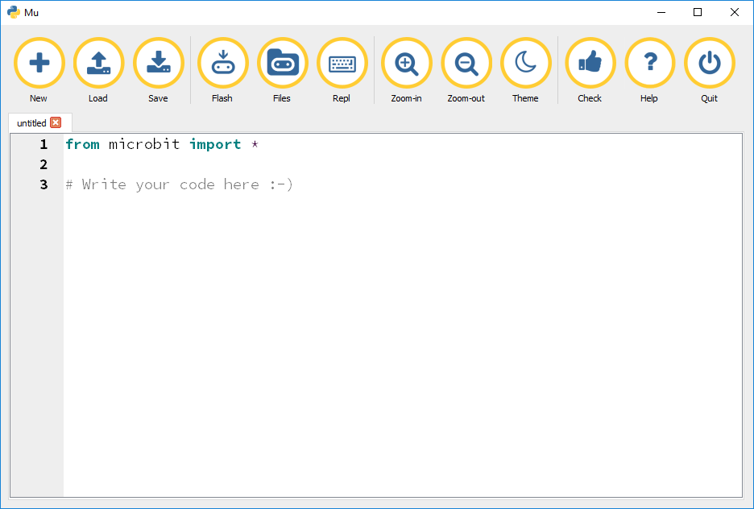

# Schreib' Deinen Code mit Mu

Mu ist ein einfacher Python Code Editor für Anfänger. Mu selbst ist in Python geschrieben und läuft auf verschiedenen Betriebssystemen.

Lade Mu von hier herunter: http://codewith.mu/. Auf einem Windows-Rechner musst Du Mu nicht mal installieren. Ein Doppelklick genügt, um das Programm zu öffnen:

Das Coole an Mu ist, dass man nicht nur Code damit schreiben kann, sondern den Code auch gleich auf den micro:bit laden kann. Dafür braucht man auf einer Windows-Maschine noch diese Treiber: [mbed Windows Serial Driver](https://developer.mbed.org/handbook/Windows-serial-configuration). Folge den Installationsinstruktionen auf der Seite.

Nachdem Du Mu und den Treiber heruntergeladen und installiert hast, kann's mit der ersten Lektion losgehen. Diese bringt Dir bei, wie Du das allererste Progrmm schreiben kannst, mit dem schon viele Programmierer das Coden gelernt haben: ["Hallo Welt!"](10_Hallo_Welt.md)
