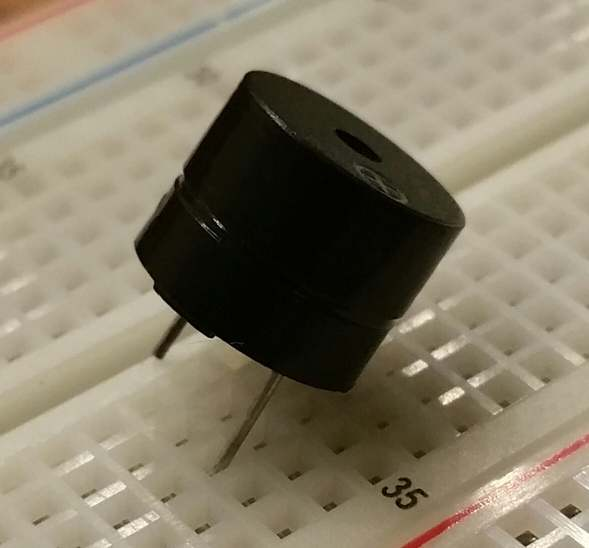

# Kontakte

Am unteren Ende von unserem micro:bit gibt es eine Reihe goldener Kontakte, die ein wenig wie Zähne aussehen. Das sind die sogenannten Input/Output **Pins** (oder einfach nur I/O Pins).

Manche von diesen Pins sind etwas größer geraten, so dass man an ihnen sogenannte Krokodilklemmen anbringen kann. Diese Pins sind beschriftet mit 0, 1, 2, 3V und GND (Computer fangen mit dem Zählen immer bei Null an und die Erde meist "Ground (GND)" genannt). Mit unserem **Edge Connector** können wir auch die kleineren Kontakte verbinden - dazu später mehr.

Jeder Pin unseres micro:bit wird von einem Objekt repräsentiert das pinN heißt, wobei N die Nummer der Pins ist. Unser Pin Nummer "0" kann also über das Objekt pin0 angesprochen werden.

Ziemlich einfach!

Diese Objekte verfügen über mehrere Methoden, je nachdem was der jeweilige Pin "kann".

## Kitzelige Python

Die einfachste Eingabe über die Pins besteht darin, zu testen, ob diese berührt werden. So kannst Du Deinen micro:bit kitzeln und ihn zum Lachen bringen:

```python
from microbit import *

while True:
    if pin0.is_touched():
        display.show(Image.HAPPY)
    else:
        display.show(Image.SAD)
```

Berühre den Pin "GND" mit der einen Hand und dann den Pin "0" mit der anderen. Das sollte Deinen micro:bit freuen und er fängt an zu lachen. Falls das nicht klappen sollte, verbinde die beiden Pins mit einem Stück Draht, das findet er super lustig!

Dies ist eine sehr einfache Art, mit einem Eingang zu arbeiten. Richtig los geht's aber erst, wenn Du andere Schaltungen oder Bauteile an die Pins anschließt.

## Der Ton macht die Musik

Eines der einfachsten Bauteile mit dem man Output erzeugen kann, ist ein Summer:



Piezo-elektrische Summer sind sehr kompakt und geben einen ziemlich hohen Ton von sich, wenn sie an eine Schlatung angeschlossen werden. Um unseren Summer an den micro:bit anzuschließen, benutzen wir nun den **Edge Connector**. Schieb' den micro:bit bis zum Anschlag in den Edge Connector, so wie hier gezeigt:


Achte darauf, dass die LEDs und Schalter der micro:bit auf der gleichen Seite sind wie die Pins des Edge Connectors.

Nun kann man mit Hilfe einer **Steckbrücke** den Summer mit dem micro:bit verbinden. Nimm dazu eine Steckbrücke mit zwei unterschiedlichen Enden und stülpe das weibliche Ende über den Pin "0". Dann nimm eine weitere Steckbrücke (mit zwei unterschiedlichen Enden) und schiebe das weiblichen Ende über einen der 0V Pins (0V ist ein noch anderer Ausdruck für Erde). Nun stecke den Summer auf unser Steckbrett. Schließe das männliche Ende der Pin "0" Steckbrücke neben dem langen Beinchen ein und das männliche Ende der "0V" Steckbrücke neben dem kurzen Beinchen des Summers. Das lange Beinchen ist der Pluspol und das kurze Beinchen ist der Minuspol:


Nun lassen wir ihn mal tönen:

```python
from microbit import *

pin0.write_digital(1)
```

Das macht ungefähr fünf Sekunden lang Spaß, bevor es anfängt unheimlich zu nerven. Wir können das Beispiel verbessern, indem wir das Bauteil piepsen lassen:

```python
from microbit import *

while True:
    pin0.write_digital(1)
    sleep(20)
    pin0.write_digital(0)
    sleep(480)
```

Wie funktioniert diese Skript? Denk' daran, dass eine "1" in der Computersprache "an" bedeutet und eine "0" bedeutet "aus".

Wir benutzen eine Endlosschleife, um Pin "1" sofort anzuschalten. Der Summer ertönt. Während der Summer lärmt, geht der micro:bit für 20 ms schlafen und schaltet danach den Pin "0" wieder aus. Dadurch ist der Piepser nur recht kurz. Dann schläft unser micro:bit wieder, diesmal für 480 ms bevor das ganze Spiel von Neuem beginnt. Dadurch bekommen wir zwei Piepser pro Sekunde (alle 500 ms einen). Wir haben uns ein einfaches metronom gebaut!

## Weiter geht's...

Bevor wir weitere Bauteile an unseren micro:bit anschließen, zeigt Dir die [nächste Lektion](35_Electronik1x1.md), was man dabei beachten muss.