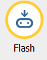

# Hello, World!

Any programmer who starts to learn a new computer language uses this code to get his device to say "Hello, World!". If not open, start Mu and enter the following:

```python
from microbit import *
display.scroll("Hello, World!")
```

These two lines instruct the micro:bit to do the following:
1. Line: Tell it that you want to use everything from the microbit module (which is a library of pre-written code)
2. Line: Tell micro:bit to use its display (the 5 x 5 LEDs) to scroll a message; in this case the message is *Hello, World!*

## Exercise

1. Copy the code into Mu and flash it onto the device. *Hint:* to do so, use the **Flash** button:



2. Try to change the message! Can you make it say hello to your class? *Hint:* you need to change the scroll method’s argument.

### WARNING!

It may fail. Usually, this is no big deal. It actually is the place where the coding fun starts! MicroPython always tries to be helpful. In case of an error, MicroPython will scroll a message on the micro:bit’s display. If possible, the line number where the error can be found will be displayed.

Check your code: did you really write it correctly? Python as a programming language expects you to type the right thing. Check you spelling (`display/Display/disPlay`) and punctuation (have you set a . between `display` and `scroll` and have you used quotation marks around `Hello, World!`?).

If your micro:bit stops responding: try power cycling it by unplugging the USB cable. Then, plug the cable back in again. You may also need to quit and re-start Mu.

## Continue...

If you are done with both exercises, continue to the [next lesson](../Lesson_02/02_Images.md).